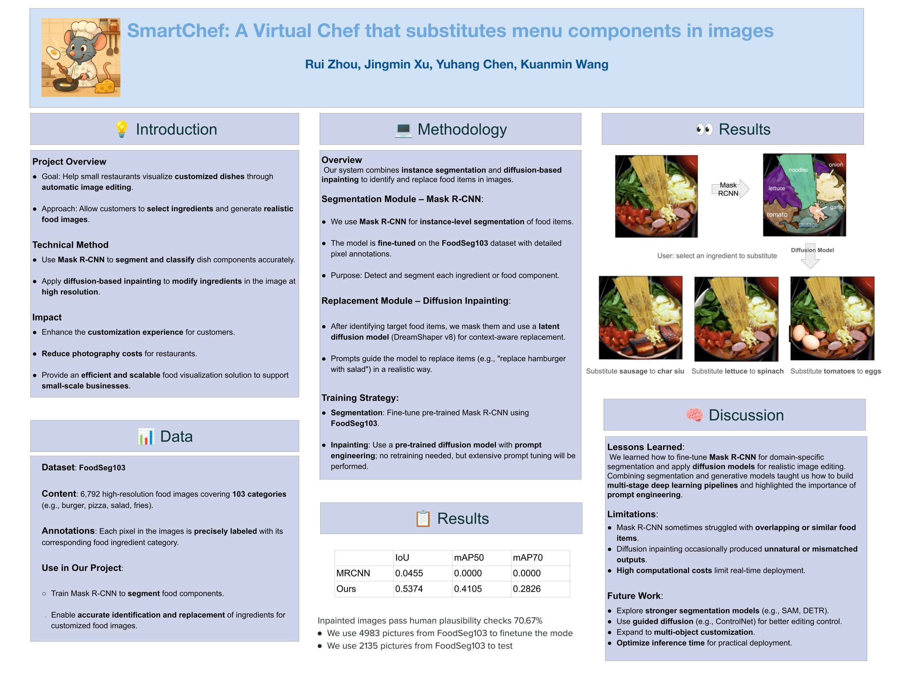

# nutrivision
nutrivision is a coined term combining “nutrition” and “vision”. The project focuses on segmentation + substitution

## Env Set up
conda create --name foodseg python=3.7.16
pip install -r requirements.txt

## Poster

